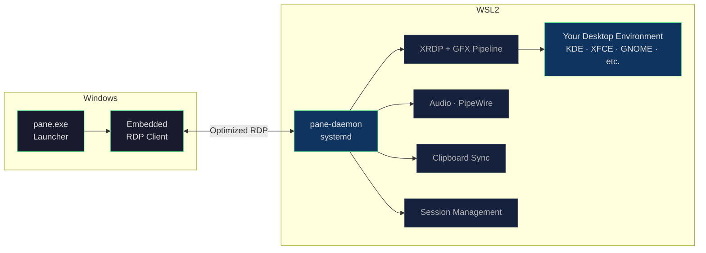

<p align="center">
  <strong>▢ Pane</strong>
</p>

<p align="center">
  A seamless Linux desktop experience on Windows — powered by WSL2.
</p>

<p align="center">
  <a href="#quick-start">Quick Start</a> · <a href="#how-it-works">How It Works</a> · <a href="#roadmap">Roadmap</a> · <a href="CONTRIBUTING.md">Contribute</a>
</p>

---

Pane gives you a full Linux desktop environment on Windows with one click. No dual boot. No VM management. Just your desktop — KDE, XFCE, GNOME, whatever you want — running inside Windows as if it belongs there.

## Why

WSL2 is great for CLI. But if you want to rice your Arch desktop, run GUI apps inside a proper DE, or just *use* Linux the way it's meant to be used — you're stuck stitching together XRDP configs, X servers, and shell scripts. Every guide is different, half are outdated, and the experience always feels like a remote session.

Pane fixes that. One binary. One command. Full desktop.

## Quick Start

```bash
pane launch
```

```bash
pane launch --de kde --distro Arch
```

```bash
pane status
```

## What It Does

- **One-click launch** — Boot into a full Linux DE from Windows with a single command
- **Automatic setup** — Configures XRDP, audio routing, clipboard sync, and display settings
- **Hardware-aware** — Detects your GPU (iGPU vs dGPU) and tunes the rendering pipeline
- **Distro-agnostic** — Works with Arch, Ubuntu, Fedora, or any WSL2 distro
- **Minimal overhead** — Written in Rust. The launcher stays out of your way

## How It Works

Pane manages the full pipeline between Windows and your WSL2 Linux desktop:



## Roadmap

| Phase | What | Status |
|-------|------|--------|
| **1** | Windows launcher + WSL2 daemon. Auto-configures XRDP, launches DE, connects via optimized RDP. | In progress |
| **2** | Embedded RDP client (via IronRDP) replacing mstsc.exe. Borderless mode, tighter keyboard/clipboard integration. | Planned |
| **3** | Custom shared-memory display transport bypassing RDP entirely for near-native latency. | Research |

## Requirements

- Windows 10 or 11 with WSL2 enabled
- A WSL2 Linux distribution installed
- A desktop environment installed in your distro (`sudo pacman -S xfce4`, etc.)

## Sponsor

If Pane is useful to you, consider supporting the project. Sponsorship helps cover development time, testing infrastructure, and keeps the project independent.

<a href="https://github.com/sponsors/NAME0x0">
  <strong>Sponsor on GitHub</strong>
</a>

Every bit helps — even starring the repo makes a difference.

## Contributing

See [CONTRIBUTING.md](CONTRIBUTING.md) for guidelines. All skill levels welcome.

## License

[MIT](LICENSE)
